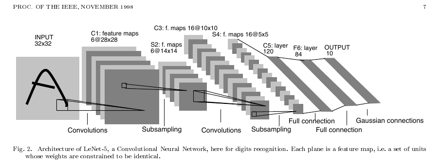
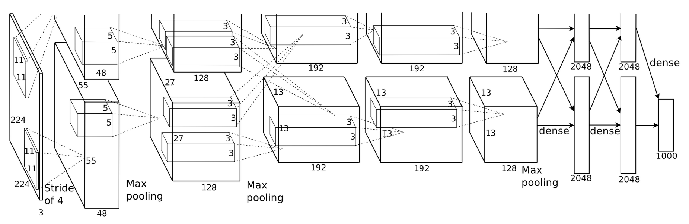

[TOC]

# 图像分类及经典CNN实现实验报告

## 项目概述

介绍：图像分类是计算机视觉领域中的重要任务之一。它涉及将图像分为不同的类别，例如识别手写数字、识别物体或人脸等。本实验旨在训练经典的卷积神经网络（CNN）模型，使其能够准确识别手写数字。

数据集：本实验使用的数据集是MNIST，包含60000张训练图像和10000张测试图像，每张图像都是一个手写数字（0-9）的灰度图像（即一层通道），大小为28x28像素

## 实验过程

### 所遇bug在此处统一标出

[bug1: 数据集输入维度不匹配](#bug1)

[bug2: 残差块最后相加的输出维度不等于残差块输入的维度](#bug2)

[bug3: 显存不足](#bug3)

[bug4: ResNet、MobileNet、GoogleNet在MNIST上表现较差](#bug4)

### 一、处理数据集

#### 1. 加载MNIST数据集

按照8：2的比例固定划分训练集为训练集和验证集

数据比例为 `train : val : test = 48000 : 12000 : 10000`

由于MNIST数据集的经典性，直接利用`torchvision.datasets`中的`MNIST`类加载即可（详见data/data_handler.py）

MNIST的部分图像如下，可见图像经过较好的降噪处理


### 二、模型实现

#### 1. LeNet

##### 1.1 模型结构

LeNet是一种经典的CNN模型，最早由Yann LeCun等人于1998年提出，用于手写数字识别任务。

原始模型结构如下：



特点：

- 激活函数：在每个卷积层和全连接层之后，通常使用非线性激活函数来引入非线性性质。在LeNet中，常用的激活函数是sigmoid函数和tanh函数

- 不完全连接：池化层1与卷积层2采用不完全连接，而pytorch本身的随机化策略即可实现这个特点

##### 1.2 模型实现

使用pytorch实现模型

<span id="bug1">_BUG1:_</span>

    传统的lenet使用32*32的图像输入，而MNIST数据集是28*28的图像输入
    解决办法：根据模型架构可以推算特征维度
    28 * 28 -->卷积--> 24 * 24 -->池化--> 12 * 12 -->卷积--> 8 * 8 -->池化--> 4 * 4
    修改全连接层的输入维度16*5*5为16*4*4
    另一解决办法是resize图像大小

代码实现详见model/lenet.py，使用Sigmoid激活函数，使用最大池化，最终使用softmax(映射到概率)输出

模型总参数量为44,426

#### 2. AlexNet

##### 2.1 模型结构

AlexNet是另一种经典的卷积神经网络模型，于2012年在ImageNet图像分类竞赛上取得了巨大成功。

原始模型结构如下：



论文使用两个CPU并行化训练，实际全连接层维度需要相加

特点：

- 首次提出使用Relu作为激活函数，并使用dropout来防止过拟合

##### 2.2 模型实现

**输入维度处理**

AlexNet使用更深的网络，训练需要花费更长的时间，另一方面MNIST仅为28x28的尺寸，而AlexNet设计为224x224尺寸图像

解决办法

1. 使用`nn.Upsample`线性缩放图片为224x224(AlexNetLarge)

```python
nn.Upsample(scale_factor=8, mode='bilinear')
```

详细代码见`model.alexnet.AlexNetLarge`

模型结构如下


网格结构与论文相同，模型参数量为58,299,082，达到千万级别

2. 缩减网络结构

庞大的参数量会导致训练成本的增加，但实际训练MNIST不需要过多的参数，因此缩减网络结构

具体改动为，将原模型的第一步卷积核从11x11改为5x5，步长改为1，将所有卷积核数均除以2，图片尺寸缩放为2倍

详细代码见`model.alexnet.AlexNet`

这样修改的模型参数量为43,446,122，缩减约百分之20，但是训练时间可以减少一半

#### 3. ResNet

##### 3.1 模型结构

ResNet网络参考了VGG19网络，在其基础上进行了修改，其核心是加入了残差学习以解决深度网络退化问题

实际的ResNet有不同的变种，拥有不同的深度和结构，本次实验选择最浅层的ResNet-18

原始模型结构如下：


3x3残差块结构如下（左）


特点：

1. 基础残差块堆叠：残差块是ResNet的核心，将输入特征加到输出特征上来学习残差。ResNet-18模型包含4个阶段，每个阶段由多个基础残差块组成。这些阶段的输出通道数分别为[64, 128, 256, 512]，每个阶段的基础残差块的个数分别为2。
2. 全局平均池化层：在最后一个基础残差块之后，ResNet-18模型使用一个全局平均池化层将特征图的大小降为1x1。

##### 3.2 模型实现

<span id="bug2">_bug2_</span>

    RuntimeError: The size of tensor a must match the size of tensor b at non-singleton dimension 3
    原因：残差块最后相加的输出维度不等于残差块输入的维度
    解决办法：增加维度不同的判断，如果维度不同或者步长不为1，卷积至相同维度
        if self.stride != 1 or x.shape[1] != out.shape[1]:
            identity = nn.functional.conv2d(
                identity, self.conv1.weight, stride=self.stride, padding=1)
    详见models/resnet.py

<span id="bug4">_模型调整(bug4)_</span>

ResNet的设计输入同样是Imgenet数据集即224x224，与AlexNet一样其目标是比MNIST更复杂的数据集

而实际上仅用28x28的MNIST数据集是能够完成卷积的，但是这样的效果并不好(准确率仅97.5%)，从结构可以发现原因:


最后两个残差块的输出维度都是1x1，学习到的特征维度过小

考虑到训练成本与不同模型输入维度的一致性，将输入数据线性放大两倍（`nn.Upsample(scale_factor=2, mode='bilinear')`），同时在最后的全连接层前添加dropout减缓过拟合，这样相对可以提升模型效果

结构代码具体见model/resnet.py

总参数量为11,001,546

#### 4. MobileNet

##### 4.1 模型结构

特点：

MobileNet是一种轻量级的卷积神经网络结构，旨在在计算资源有限的移动设备上实现高效的图像分类和目标检测。

其核心是通过使用深度可分离卷积来减少参数数量和计算量，从而实现了较小的模型尺寸和快速的推理速度。

即将普通卷积拆分成深度卷积和逐点卷积，这样可以在获得差不多效果的同时减少计算量。

##### 4.2 模型实现

MobileNet共有三个版本，这里仅实现MobileNetV1

V1原始模型如下

深度可分离结构(右):


网络结构：


模型调整上与前文一样，将输入数据放大两倍，同时在最后的全连接层前添加dropout

另外，从论文中可以发现最后的平均池化层是7x7的，如果仅仅输入放大两倍的话不足够池化，所以此处和ResNet一样改为全局平均池化为1x1

其余部分按照论文结构编写，代码详见models/mobilenet.py

#### 5. GoogleNet

##### 5.1 模型结构

GoogLeNet是谷歌团队为参加ILSVRC 2014比赛而准备，其核心是提出了inception结构，主要思想是同时使用多个不同大小的卷积核并将它们的输出连接在一起

特点：

inceptionv1结构如下


- 并行化可以从不同角度学习到更多特征

##### 5.2 模型实现

这里仅实现v1结构

模型结构如下：


在模型的调整上，输入数据集的放大，修改池化层为全局平均池化与前文一致

另外值得一提的是，论文中dropout参数设置为0.4，对于MNIST实际结果中会导致丢失信息过多，猜测是由于Googlenet使用并行卷积的处理方式，一个块学习到的特征很多，按比例dropout会导致丢失的信息也很多，所以最后设置dropout为0.2结果较好

其余部分按照论文结构编写，代码详见models/googlenet.py

### 三、模型对比

#### 1. 模型实现总结

对于五种模型均尽量按照论文结构复现，部分微调如下：

- 仅lenet按照28x28尺寸输入，其余模型调整为56x56尺寸输入

- 由于除lenet外的模型都是更深的网络结构，为更复杂的数据集而设计，而对于MNIST数据集可能容易过拟合，所以除lenet外都在全连接层前面添加dropout

- 对于AlexNet，缩减了网络结构以减少训练时间，但可训练参数量仍保持最大

- Googlenet与Mobilenet最后的7x7池化改为全局平均池化

- Resnet实现的是ResNet-18，MobileNet实现的是MobileNetV1，Googlenet实现的是最开始的版本

#### 2. 模型间横向对比

统一超参数为`batch_size = 128, lr = 0.001, epoch = 5, optimizer = Adamw`

关于dropout，lenet未设立，googlenet设定为0.2，其余设定为0.5

统一使用交叉熵损失函数

设立随机种子为42，以使结果可复现

```python
def set_seed(seed):
    torch.backends.cudnn.deterministic = True
    torch.backends.cudnn.benchmark = False
    torch.manual_seed(seed)
    torch.cuda.manual_seed_all(seed)

set_seed(42)
```

训练GPU为`NVIDIA GeForce MX250`，训练平台为本地linux环境(使用轻量极桌面环境以压榨显卡性能)

<span id="bug3">_bug3_</span>

    CUDA out of memeory
    解决办法：根据错误提示设定环境变量，如下
    os.environ["PYTORCH_CUDA_ALLOC_CONF"] = "max_split_size_mb:100"
    也可以使用nvidia-smi命令查看显存使用情况，kill无用的进程

**训练结果如下**

| 模型      | 测试集分类准确率 | 训练时间/s | 参数数量 |
| --------- | ---------------- | ---------- | -------- |
| LeNet     | 97.44%           | 40.02      | 44426    |
| AlexNet   | 99.13%           | 708.38     | 43446122 |
| ResNet    | 99.30%           | 1012.85    | 11001546 |
| MobileNet | 98.36%           | 666.95     | 3216650  |
| GoogleNet | 98.80%           | 693.56     | 5977530  |

(详细结果可于analyse.ipynb查看)

各指标柱状图如下


**训练结果对比分析:**

- LeNet与其余模型对比：

  - 从参数量上看，LeNet由于提出时间较早以及目标数据集尺寸较小，参数量最少，而其余模型参数量都较大，使用更宽更深的网络结构，因此训练时间相比LeNet较长

  - 其余模型更宽更深的网络结构在经过合适的调整下可以获得更好的训练效果

- ResNet与AlexNet对比：

  - ResNet参数量也达到了千万级别，但相比AlexNet较小，但是训练时间反而较长，原因在与，ResNet引入额外的残差学习，需要耗费更多的时间，另外AlexNet的大多数参数在全连接层的神经元上，实际网络并不深

  - ResNet的准确率最高，AlexNet次之，体现出残差学习的好处：缓解深度网络的退化问题

- MobilNet与其余模型对比：

  - MobileNet的参数量除LeNet外最小，同时由于其深度可分离结构，计算量和训练时间也较小，但同时可以获得差不多的训练效果(0.5-1%的差距)

- GoogleNet与其余模型对比：

  - GoogleNet的参数量相较MobilNet较多，但是与AlexNet/ResNet的差距又较大

  - 并行化卷积可以学习到更多更复杂的特征，但由于MNIST较为简单，GoogleNet相对无法体现优势，但是其仍然获得了较好的效果

**验证集准确率随训练步数变化图**


通过验证集准确率的变化趋势可以看出

- LeNet的由于网络结构较浅，需要更多的步数才能学习到更多的特征，因此准确率变化幅度最大

- 对于GoogleNet来说，其从并行学习更复杂的特征，因此也需要较多的步数来获得较好的准确率，另外与MobilNet一样，相对ResNet-18/AlexNet的网络结构更深，因此特征传递需要更多步数

- 对于ResNet/AlexNet来说，AlexNet的参数量更加庞大，但是网络并不深，而ResNet的残差结构允许信息直接跳过一些层级，信息传递更快，因此均仅训练一步即可获得较好的效果

**训练集损失随每批次数据变化图**


从损失变化趋势可以看出

- 由于随机梯度下降的特点，损失呈波动性下降（实际图像经过平滑化处理）

- 与其他模型相比，lenet的收敛更慢，并且最终的损失也多于其他网络，说明更深更宽的网络可以带来更好的性能

- GoogleNet的收敛也较慢，和其并行卷积学习复杂特征的特点有关

- ResNet和AlexNet因其庞大的网络结构学习特征最快，因此收敛最快，而MobilNet次之，符合其设计目的：在减少计算量的同时获得差不多的效果

#### 3. 影响模型性能的因素及其原因

对于所有模型：

- 输入图片尺寸大小

  - 放大图片尺寸可以学习到更多的特征，但是训练成本会增加

  - 更改LeNet的图片输入为54x54，可以提升百分之0.5的准确率

- dropout

  - 超参数会明显影响模型性能，特别是对于更深的网络，dropout的影响更为明显

  - 对于除LeNet外的深度模型，dropout可以缓解学习特征过多而产生过拟合问题

  - 需要选择合适的dropout率，如对于GoogleNet来说，并行卷积会导致一个块学习的特征较多，相比其他模型相同dropout率的情况下可能会丢失更多信息导致模型训练缓慢

- 模型结构和深度：

  - 更深的模型结构带来更高级别的抽象能力，可以应用于更复杂的场景，但是要注意梯度消失与梯度爆炸问题
  - 除Lenet外的模型结构都更深，在最终结果上都优于Lenet

对于单独模型：

- 残差连接：

  - Resnet的残差连接解决了梯度消失和梯度爆炸问题，更深的网络不会受退化问题而获得更好的收敛

- 并行结构：

  - GoogleNet的Inception模块提取多个不同尺度的特征，获得更丰富的表征能力，可以适用于更复杂的数据集

- 深度可分离：

  - MobileNet的深度可分离卷积减少了参数量和计算量，但效果不会减少很多，使得模型能够在计算资源有限的设备上高效运行

## 实验总结

本次实验实现了5个经典的CNN模型并应用于MNIST数据集的数字识别任务，通过本次实验，了解到CNN模型的发展过程（1998年的lenet到2017年的mobilenet），网络结构的变化（深度，宽度），了解到独特的结构（残差块，Inception，深度可分离）及其适用场景（不同复杂度的数据集，不同计算量的平台），也实践了对原始网络结构的更改以适用特定的任务，从而对卷积神经网络有更全面的了解
